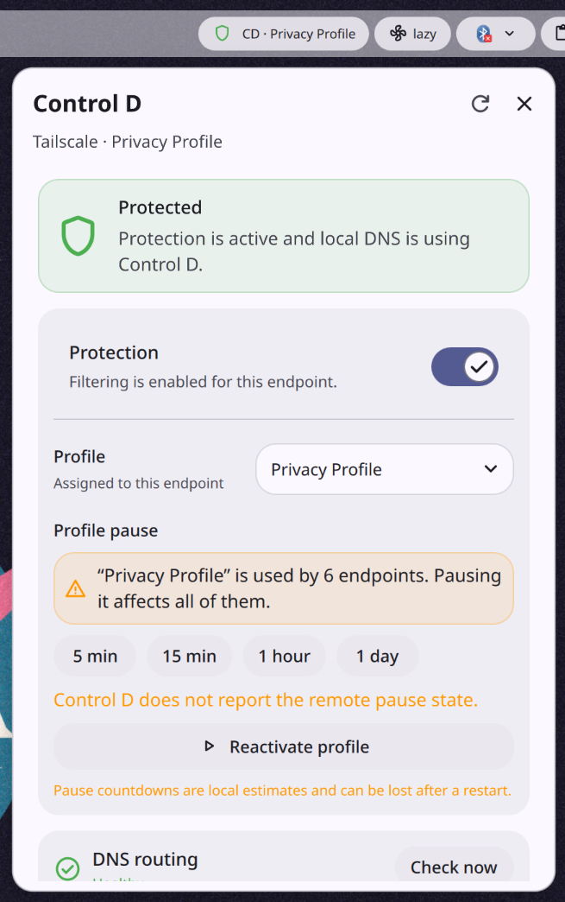

# Control D for DankMaterialShell

A [DankMaterialShell](https://github.com/AvengeMedia/DankMaterialShell) plugin for monitoring and controlling one Control D endpoint from DankBar. A single background daemon owns credentials, polling, DNS checks, cached state, and writes, so multiple widget instances share the same confirmed state.

## Preview



## Features

- Shows the selected endpoint, active profile, protection state, API health, and local DNS status.
- Switches between existing Control D profiles without updating the UI until the server confirms the change.
- Turns protection on or soft-disables it while keeping DNS resolution active. The plugin never hard-disables an endpoint.
- Pauses the active profile for 5 minutes, 15 minutes, 1 hour, or 1 day, with a warning when that profile is shared by multiple endpoints.
- Checks the local `verify.controld.com` route independently from the account API, distinguishing a Control D misconfiguration from a general DNS or network failure.
- Keeps sanitized cached state visible as stale when Control D is temporarily unavailable.

## Requirements

- DankMaterialShell 1.5.0 or newer.
- `nslookup` on the `PATH` inherited by DMS.
- A [Control D API token](https://docs.controld.com/reference/authentication): Read access is sufficient for monitoring; Write access is required for controls.
- One credential provider:
  - `secret-tool` and a Freedesktop Secret Service provider, such as GNOME Keyring or KWallet; or
  - `CONTROL_D_API_TOKEN` in the environment inherited by DMS.

## Installation

Clone the repository into the DMS plugin directory:

```sh
git clone https://github.com/clementpoiret/dms-controld \
  ~/.config/DankMaterialShell/plugins/controld
```

Then:

1. Open **DMS Settings → Plugins**.
2. Scan for plugins and enable **Control D**.
3. Add **Control D** to the DankBar widget list.

## Setup

1. Open the plugin settings and select a credential provider.
2. For **Secret Service**, paste a token and choose **Save and test**. For **Environment variable**, make `CONTROL_D_API_TOKEN` available to the DMS process, restart DMS, and choose **Test environment token**.
3. Enter an organization ID only when the token needs to act on a child organization.
4. Refresh the account, select the endpoint representing this machine, and choose **Use this endpoint**.
5. Run the DNS check to confirm that the machine is using Control D locally.

Endpoint association is intentionally manual because the account API does not identify which endpoint represents the current Linux machine.

## Usage

Click the DankBar pill to open the controls:

- **Protection** sends status `1` when enabled and status `2` when disabled. No plugin action sends hard-disabled status `3`.
- **Profile** assigns an existing profile to the selected endpoint.
- **Profile pause** writes a profile-wide expiry. Pausing a shared profile affects every endpoint using it.
- **DNS routing** runs an immediate local check without changing account configuration.

Mutations are serialized, never retried automatically, and displayed only after server read-back. A timed-out write triggers a refresh because the remote result may be uncertain.

### Unconfirmed profile pauses

Some Control D responses accept `disable_ttl` writes without returning that field in later profile reads. **Allow unconfirmed pauses** is therefore off by default.

When enabled, the countdown is a local estimate. Reloading the plugin or restarting DMS can lose that estimate while the remote pause remains active. **Reactivate profile** remains available to send `disable_ttl=0` manually.

## Security and permissions

The API token is never saved in DMS settings, plugin state, shared variables, diagnostics, or process arguments. Secret Service storage sends the token to `secret-tool store` through standard input; the environment provider reads it into daemon memory and never persists it.

The plugin requests:

- `settings_read` and `settings_write` for non-secret configuration and sanitized cached state;
- `network` for the fixed `https://api.controld.com` endpoint;
- `process` for `nslookup` and optional `secret-tool` access.

DMS plugins share the user's desktop process and are not isolated from one another. Install only trusted plugins when using a Write token.

## Troubleshooting

### The plugin cannot be enabled

Confirm that `nslookup` is available to DMS:

```sh
command -v nslookup
```

### Secret Service is unavailable

Confirm that `secret-tool` is installed and a Secret Service provider is running:

```sh
command -v secret-tool
```

The environment provider remains available when Secret Service tooling is missing.

### Controls are read-only

A Read token can load account state but cannot change protection, profiles, or pauses. Configure a dedicated Write token; write access is confirmed by the first legitimate change rather than a no-op test write.

### DNS is healthy but a browser is not using Control D

The DNS probe checks the operating system route. Browser-specific DNS-over-HTTPS can bypass that route.

Control D's account API is unversioned. If required response fields change, the plugin fails closed instead of acting on partial data.

## Development

Run the automated QML tests with Qt 6:

```sh
QML_XHR_ALLOW_FILE_READ=1 qmltestrunner -input tests -o -,txt
```

If Qt modules are outside the default search path, set `QML2_IMPORT_PATH` before running the command. The fixtures contain only sanitized example data.

Run the Secret Service process-lifecycle smoke test with Quickshell:

```sh
quickshell --path SecretStoreSmoke.qml
```

Reload an installed development copy with:

```sh
dms ipc call plugins reload controlD
```

## License

[MIT](LICENSE)
